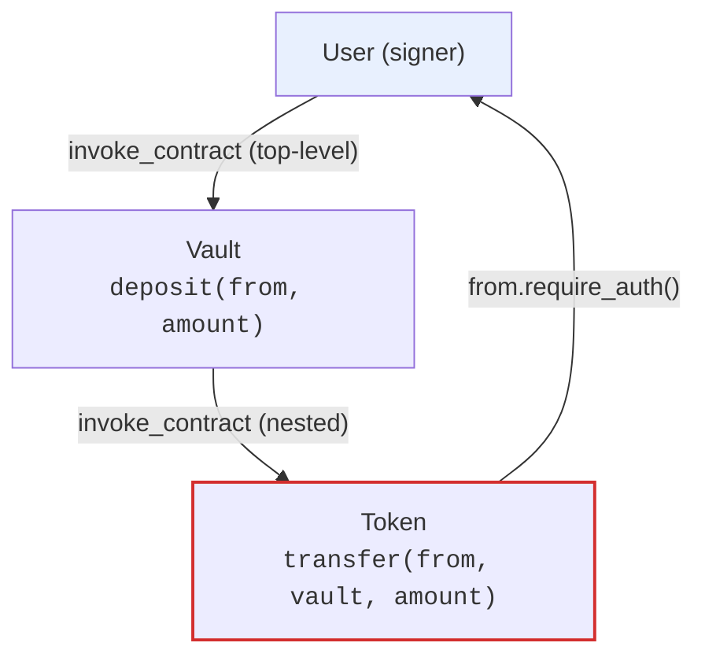
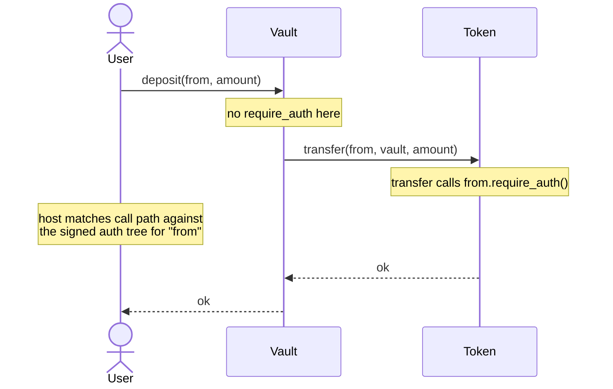
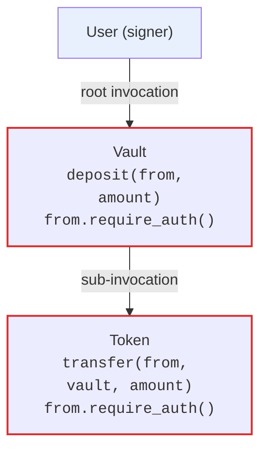

# Authorization Trees and Sub-Invocations

When contract A calls contract B and contract B calls `require_auth` for a user, Soroban does not simply check "did the user sign anything?". It verifies that the user signed an **authorization tree** that covers the *exact* call chain: which contract is being invoked, with which function and arguments, and which nested calls that invocation is allowed to make. Any mismatch — a different argument, a missing nested call, or a call made in a different order — fails the whole transaction.

This guide explains what authorization trees are, walks through the two-level tree built by the [`examples/cross-contract`](https://github.com/Soroban-Cookbook/Soroban_Cookbook_online/tree/main/examples/cross-contract) vault example, shows how to test nested authorization with `mock_all_auths` / `mock_auths`, and how to debug the `Error(Auth, InvalidAction)` failure that dominates this topic.

## What is an authorization tree?

A Soroban transaction carries a list of `SorobanAuthorizationEntry` items. Each entry pairs an authorizer (an `Address`) with an **authorized invocation tree**: a root invocation plus its nested `sub_invocations`.

```json
{
  "address": "user",
  "invocation": {
    "contract_id": "vault_contract",
    "function": "deposit",
    "args": ["user", 1000],
    "sub_invocations": [
      {
        "contract_id": "token_contract",
        "function": "transfer",
        "args": ["user", "vault_contract", 1000],
        "sub_invocations": []
      }
    ]
  }
}
```

Every node in the tree names a contract function call with its exact arguments. When the host executes a contract that calls `require_auth`, it matches the current call path against the signed tree for that address. The signature payload is built from this tree, which is why a wallet can show you "This transaction authorizes `vault.deposit`, which will call `token.transfer` for 1000 units" before you sign.

The tree is a *tree*, not a flat list, because **nesting matters**. If a user signs the path `A.foo → B.bar → C.baz`, the authorization check fails if `A.foo` calls `C.baz` directly — `C.baz` strictly has to be reached through `B.bar`. The host condenses the full call graph to the nodes where `require_auth` was called for that address (the "R-nodes"), and the signed tree must match that condensed path.

## A two-level example: the cross-contract vault

The [`examples/cross-contract`](https://github.com/Soroban-Cookbook/Soroban_Cookbook_online/tree/main/examples/cross-contract) crate contains a `Vault` contract that calls a `Token` contract. The relevant flow is `deposit`:

```rust
// examples/cross-contract/src/vault.rs (abridged)
pub fn deposit(env: Env, from: Address, amount: i128) -> Result<(), VaultError> {
    // ... validate amount and emergency mode ...
    let token_client = TokenClient::new(&env, &token_contract);
    token_client.try_transfer(&from, &env.current_contract_address(), &amount)?;
    Ok(())
}
```

```rust
// examples/cross-contract/src/token.rs (abridged)
pub fn transfer(env: Env, from: Address, to: Address, amount: i128) -> Result<(), TokenError> {
    from.require_auth(); // <-- the authorization checkpoint
    // ... move balances ...
    Ok(())
}
```



The authorization checkpoint happens inside the *callee*: `token.transfer` calls `from.require_auth()`. The host must find an authorized invocation tree for `from` whose current path matches the `token.transfer` frame.



Because `vault.deposit` does *not* call `require_auth` for `from`, the auth tree the user must sign condenses to a single node — the token transfer itself:

```json
{
  "address": "user",
  "invocation": {
    "contract_id": "token_contract",
    "function": "transfer",
    "args": ["user", "vault_contract", 1000],
    "sub_invocations": []
  }
}
```

The vault call is stripped from the tree because no `require_auth` happened there. This is the **unbound** pattern: the user signs the nested transfer directly. See the [binding pattern](#binding-nested-calls-to-your-contract) below for the alternative.

You can see a real two-level tree with a root plus a `sub_invocations` entry in the test snapshots of the [`examples/flash-loan`](https://github.com/Soroban-Cookbook/Soroban_Cookbook_online/blob/main/examples/flash-loan/test_snapshots/tests/test_flash_loan_reverts_when_receiver_does_not_repay.1.json) crate, where `deposit_liquidity` is the root and `transfer` is its sub-invocation.

## How `require_auth` is checked

When `require_auth` (or `require_auth_for_args`) is called for a non-contract-invoker address, the host:

1. **Finds a matching authorized invocation tree** for the current call path. The path is matched against the signed trees; a tree only matches if the exact chain of R-nodes leading to the current call was signed.
2. **Authenticates** — verifies signature expiration, consumes a nonce (replay protection), builds the signature payload preimage, and hands it to the address's `__check_auth` (for Stellar accounts this verifies the Ed25519 signature; for contract accounts it runs the account's own logic).
3. **Marks the invocation exhausted**, so each signed node can only be consumed once.

Authentication happens once per tree — the whole tree is signed as one payload. Contract invokers are special: `require_auth` for the *direct* invoker contract's own address is considered automatically authorized, because the contract chose to make the call. Addresses deeper down the stack are not.

### `require_auth` vs `require_auth_for_args` vs `env.authorize_as_current_contract`

- **`Address::require_auth()`** — checks that the current function frame is authorized for the address.
- **`Address::require_auth_for_args(args)`** — same check, but against a custom set of invocation arguments instead of the current frame's arguments. Use it when the real arguments contain internal data you don't want users to sign (e.g. an id derived inside the contract), or when you want to authorize a synthetic action.
- **`Env::authorize_as_current_contract(address)`** — the low-level host function that `require_auth` calls under the hood. You almost never call it directly; it exists so advanced contracts can build custom authorization flows.

The auth tree itself does not care *which* of these triggered the check — only that the resulting invocation (contract, function, args) appears in the signed tree at the right position in the path.

## Binding nested calls to your contract

The vault example above leaves the user's signature on the bare token transfer. If you want the signature to be scoped to *your* contract call, call `require_auth` in the caller too, before the nested call:

```rust
pub fn deposit(env: Env, from: Address, amount: i128) -> Result<(), VaultError> {
    from.require_auth(); // bind the nested transfer to this exact deposit call

    let token_client = TokenClient::new(&env, &token_contract);
    token_client.try_transfer(&from, &env.current_contract_address(), &amount)?;
    Ok(())
}
```

Now the signed tree is two levels:

```json
{
  "address": "user",
  "invocation": {
    "contract_id": "vault_contract",
    "function": "deposit",
    "args": ["user", 1000],
    "sub_invocations": [
      {
        "contract_id": "token_contract",
        "function": "transfer",
        "args": ["user", "vault_contract", 1000],
        "sub_invocations": []
      }
    ]
  }
}
```



Both nodes appear because `require_auth` is called at both levels. This is the pattern used by [`examples/flash-loan`](https://github.com/Soroban-Cookbook/Soroban_Cookbook_online/tree/main/examples/flash-loan), and it is the recommended default for cross-contract flows that move user assets: the authorization for the inner call cannot be reused outside your contract, and wallets can render the full call chain.

The official guidance for deciding where to call `require_auth`:

- If access to an address's data is **read-only**, `require_auth` is usually not needed.
- If the address's data is being **modified**, `require_auth` is needed (e.g. decreasing a token balance), unless the change is strictly beneficial to the user (e.g. minting to them).
- If you call a contract that will `require_auth` for the address (e.g. `token.transfer`), calling `require_auth` in your own contract **binds** that inner authorization to your exact call.

## Testing authorization trees

Tests run against the sandboxed `Env`, which can simulate signatures. The [`examples/cross-contract/src/test.rs`](https://github.com/Soroban-Cookbook/Soroban_Cookbook_online/blob/main/examples/cross-contract/src/test.rs) `test_authorization_requirements` test is the canonical pattern: use `mock_all_auths()` for setup, then `clear_all_auths()` and assert that operations fail without real auth.

```rust
// examples/cross-contract/src/test.rs (abridged)
#[test]
fn test_authorization_requirements() {
    let env = Env::default();

    let token_id = env.register(Token, ());
    let token_client = TokenClient::new(&env, &token_id);
    let vault_id = env.register(Vault, ());
    let vault_client = VaultClient::new(&env, &vault_id);

    let admin = Address::generate(&env);
    let user = Address::generate(&env);

    // Setup with auth mocked (deploy, initialize, mint)
    env.mock_all_auths();
    token_client.initialize(&admin);
    vault_client.initialize(&token_id, &admin);
    token_client.mint(&user, &1000i128).unwrap();
    env.clear_all_auths();

    // Without the user's signature, the nested token transfer cannot be authorized
    let result = vault_client.try_deposit(&user, &100i128);
    assert!(result.is_err()); // HostError: Error(Auth, InvalidAction)
}
```

Test utilities you will use:

| Utility | Effect |
| --- | --- |
| `env.mock_all_auths()` | Every `require_auth` call succeeds. Fast, but hides tree-shape mistakes. |
| `env.clear_all_auths()` | Re-enables real (simulated) signature checks. |
| `env.mock_auths(&[MockAuth { ... }])` | Succeeds only for the exact (address, invocation) pairs listed — including their `sub_invokes`. |
| `env.set_auths(&[SorobanAuthorizationEntry])` | Installs explicit auth entries, as if a client had signed them. |
| `env.auths()` | Returns the `(Address, AuthorizedInvocation)` pairs that `require_auth` was called for in the last invocation — the exact tree a client would have to sign. |

`env.auths()` is the most precise way to pin down the shape of the tree: it returns the authorizations seen in the most recent invocation. After a successful (mocked) deposit, assert that the vault flow only ever requires the single nested `transfer` node:

```rust
use soroban_sdk::testutils::{AuthorizedFunction, AuthorizedInvocation};

#[test]
fn test_deposit_auth_tree() {
    let env = Env::default();
    env.mock_all_auths();

    let token_id = env.register(Token, ());
    let token_client = TokenClient::new(&env, &token_id);
    let vault_id = env.register(Vault, ());
    let vault_client = VaultClient::new(&env, &vault_id);

    let admin = Address::generate(&env);
    let user = Address::generate(&env);

    token_client.initialize(&admin);
    vault_client.initialize(&token_id, &admin);
    token_client.mint(&user, &1000i128).unwrap();

    vault_client.deposit(&user, &100i128).unwrap();

    // The unbound vault only requires the user to authorize the nested transfer
    assert_eq!(
        env.auths(),
        std::vec![(
            user.clone(),
            AuthorizedInvocation {
                function: AuthorizedFunction::Contract((
                    token_id.clone(),
                    symbol_short!("transfer"),
                    (user.clone(), vault_id.clone(), 100i128).into_val(&env),
                )),
                sub_invocations: std::vec![],
            },
        )],
    );
}
```

If you bind with `require_auth` in the caller (see above), the same assertion must include the `deposit` root with the `transfer` in its `sub_invocations`. When a test *does* pass with `mock_all_auths()` but fails with real auth, compare `env.auths()` against what your client (or `set_auths`) actually signs — the mismatch is the bug. See the debugging section below.

## Debugging `Error(Auth, InvalidAction)`

`HostError: Error(Auth, InvalidAction)` is the failure you will see most often with nested invocations. It means the host could not match the current call path to any signed authorization tree for the address that called `require_auth`. The [`examples/multisig-wallet`](https://github.com/Soroban-Cookbook/Soroban_Cookbook_online/blob/main/examples/multisig-wallet/src/test.rs) test suite pins this exact behavior:

```rust
#[test]
#[should_panic(expected = "HostError: Error(Auth, InvalidAction)")]
fn test_deposit_unauthorized() {
    let f = setup_2of3();
    f._env.set_auths(&[]); // no signatures at all
    f.wallet.deposit(&f.alice, &f.token.address, &100);
}
```

### Common causes

| Cause | What is wrong | Fix |
| --- | --- | --- |
| Missing nested call | The signer authorized the root call but the signed tree has no `sub_invocations` entry for the nested `require_auth` frame. | Make the client include the full tree, or bind with `require_auth` in the caller so the tree shape is explicit. |
| Argument mismatch | Any argument differs from what the frame was called with — even a field inside a struct. Args are hashed into the tree. | Compare the args in the signed tree with the actual call, byte for byte. |
| Wrong path / order | The signed path is `A.foo → C.baz` but execution reaches `C.baz` via `A.foo → B.bar → C.baz` (or vice-versa). Nesting is significant. | Sign the exact execution path; don't flatten trees. |
| Wrong signer | `require_auth` was called on a different address than the one that signed. | Check which `Address` actually calls `require_auth` at runtime. |
| Auths cleared in tests | `clear_all_auths()` (or `set_auths(&[])`) left the env with no signatures. | Provide the needed auths or keep `mock_all_auths()` for the setup phase. |
| Reuse of an exhausted node | The same signed invocation was already consumed by an earlier `require_auth` in the same transaction. | Sign a separate node per `require_auth` call (duplicate calls need duplicate nodes). |

### Debugging steps

1. **Reproduce with real auth, not mocks.** Add a test without `mock_all_auths()` that calls the failing function via `try_<function>` and prints the error.
2. **Inspect the required tree with `env.auths()`.** Run the failing path with `mock_all_auths()` and print `env.auths()` — it shows the exact `(address, invocation)` pairs, `sub_invocations` included, that a client must sign. Diff that against what your client (or `set_auths`) actually provides.
3. **Inspect the recorded snapshots.** The repo's [`test_snapshots`](https://github.com/Soroban-Cookbook/Soroban_Cookbook_online/tree/main/examples/flash-loan/test_snapshots) JSON files record the exact `auth` entries (including `sub_invocations`) for each test. Diff the failing call against a passing snapshot to see which node is missing or mismatched.
4. **Check the arguments.** The most common silent bug: the contract calls `transfer` with a slightly different argument (e.g. a different `to` address) than the one the client signed.
5. **Verify the call path.** Confirm the nested call really goes through the frames you think it does. A helper that performs a call inline can silently change the tree path.
6. **Use `require_auth` bindings deliberately.** If the tree shape is hard to reason about, add `require_auth` in the caller so the signed tree has an explicit root and the client tooling has an unambiguous shape to sign.

## Best practices

- **Bind nested asset moves.** Call `require_auth` in the caller before invoking a callee that will `require_auth` for the same address — the signed tree then includes your contract, and the inner authorization can't be reused elsewhere.
- **Keep the tree small and explicit.** Fewer `require_auth` calls mean fewer nodes, smaller signatures, and less that can mismatch. Prefer one clear root over many scattered checks.
- **Test both with and without `mock_all_auths()`.** `mock_all_auths()` verifies logic; a real-auth test verifies the tree shape. Both are needed.
- **Use `require_auth_for_args` to hide internal arguments.** If a call's real arguments include contract-derived values, sign a stable, user-meaningful argument list instead.
- **Pin the callee address.** A stored callee address that can be changed (see [Cross-Contract Invocation](./cross-contract-invocation.md)) changes which contract's `require_auth` frames appear in the tree — guard updates with admin auth.
- **Snapshot your auth trees.** The repo's test snapshot workflow makes auth-tree regressions visible in diffs; keep it on for contracts with nested calls.

## Related reading

- [Authorization](./authorization.md) — `require_auth` basics and access-control patterns
- [Cross-Contract Invocation](./cross-contract-invocation.md) — mechanics of nested calls and defensive patterns
- [Error Handling](./error-handling.md) — `try_*` methods and error propagation across calls
- [Testing Strategies](./testing-strategies.md) — test utilities including `mock_all_auths`
- [Authorization & Access Control Patterns](../patterns/authorization.mdx) — role-based and capability-based authorization
- [Security Fundamentals](../security/fundamentals.md) — access control and reentrancy checklists
