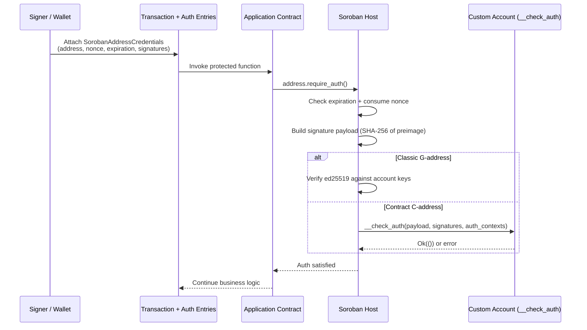

# Custom Accounts

Soroban addresses can represent **classic Stellar accounts** (`G…`) or **contract accounts** (`C…`). A contract that implements the reserved `__check_auth` entrypoint becomes a **custom account**: the host delegates authentication and policy decisions to that contract whenever another contract calls `require_auth` on its address.

This is a different trust model from calling `require_auth` inside a normal application contract. Application contracts declare *who* must authorize; custom accounts define *how* that authorization is proven and which policies apply.

## Mental model

| Role | What it does |
| --- | --- |
| Application contract | Calls `address.require_auth()` (or `require_auth_for_args`) to gate sensitive work |
| Soroban host | Matches auth entries, verifies expiration, consumes nonces, builds the signature payload, and invokes `__check_auth` for contract accounts |
| Custom account (`__check_auth`) | Verifies signatures in an account-defined format and optionally enforces spend limits, weights, allowlists, or other policy |



## `__check_auth` execution flow

When the host authenticates a contract account address:

1. Confirm the signature has not expired (`signature_expiration_ledger`).
2. Ensure the nonce is unused for this address until that expiration (replay protection).
3. Build the expected signature payload preimage (network + credentials + auth tree) and hash it.
4. Call the account contract's `__check_auth` with:
   - `signature_payload` — 32-byte hash the signatures must cover
   - `signatures` — account-defined `Val` / typed signature payload
   - `auth_contexts` — the invocation tree being authorized (contracts, functions, args)
5. Treat any error or trap from `__check_auth` as failed authentication.

```text
require_auth(custom_account_address)
        │
        ▼
┌───────────────────────────────┐
│ Host: expiration + nonce OK?  │──no──▶ auth fails
└───────────────┬───────────────┘
                │ yes
                ▼
┌───────────────────────────────┐
│ Host: compute signature       │
│ payload from auth tree        │
└───────────────┬───────────────┘
                │
                ▼
┌───────────────────────────────┐
│ Account::__check_auth(...)    │
│  • verify crypto signatures   │
│  • evaluate policy on contexts│
└───────────────┬───────────────┘
                │
         Ok(()) │  Err / trap
                ▼
           auth OK / fail
```

### Sketch (SDK shape)

```rust
use soroban_sdk::{
    auth::{Context, CustomAccountInterface},
    contract, contracterror, contractimpl, BytesN, Env, Vec,
};

#[contracterror]
#[derive(Copy, Clone, Debug, Eq, PartialEq)]
#[repr(u32)]
pub enum AccError {
    BadSignature = 1,
    PolicyDenied = 2,
}

#[contract]
pub struct SmartWallet;

#[contractimpl]
impl CustomAccountInterface for SmartWallet {
    type Signature = BytesN<64>;
    type Error = AccError;

    #[allow(non_snake_case)]
    fn __check_auth(
        env: Env,
        signature_payload: BytesN<32>,
        signature: Self::Signature,
        auth_contexts: Vec<Context>,
    ) -> Result<(), AccError> {
        // 1) Authenticate: verify the signature covers signature_payload.
        // 2) Authorize: inspect auth_contexts for spend limits / allowlists.
        // Do NOT call require_auth on this contract's own address (recursion).
        let _ = (env, signature_payload, signature, auth_contexts);
        Ok(())
    }
}
```

:::info Host-only entrypoint
`__check_auth` is reserved. Direct client calls fail. The host invokes it only during `require_auth` verification, so it is safe to update account-owned policy state (for example per-period spend counters) inside `__check_auth`.
:::

## Custom accounts vs `require_auth` on normal contracts

| Concern | Normal contract + `require_auth` | Custom account (`__check_auth`) |
| --- | --- | --- |
| Trust boundary | Host proves the `Address` authorized this call tree | Host still handles nonce/expiration; **your** contract proves signatures and policy |
| Who defines auth rules | Application decides *which* addresses must sign | Account decides *how* signing works (multisig, session keys, social recovery) |
| Replay protection | Host-managed nonces on auth credentials | Same host nonce rules; do not invent a second conflicting nonce scheme unless you understand the trade-offs |
| Failure mode | Missing / invalid auth entry | `__check_auth` returns error or traps |
| Typical bugs | Forgetting `require_auth`, wrong address | Weak signature checks, ignoring `auth_contexts`, policy bypasses |

Use custom accounts when you need account abstraction: weighted multisig, spending limits, passkeys/session keys, or recovery flows. For ordinary app permissions (owner-only admin), prefer simple `require_auth` on the caller's address without implementing an account contract.

## Replay attacks, nonces, and expiration

Soroban address credentials include:

- **Nonce** — arbitrary `i64` that must be unique among non-expired credentials for that address
- **Signature expiration ledger** — inclusive last ledger where the signature remains valid
- **Signature payload** — bound to the network and the exact authorization tree

### What the host already does

- Rejects expired signatures.
- Rejects reused nonces while the prior credential has not expired.
- Consumes the nonce only after authentication succeeds for a matched root invocation.

That means **replay of the same signed auth entry is blocked by the host** for the credential's lifetime. Custom accounts should not skip host-backed credentials or accept detached signatures that are not bound to the host-provided `signature_payload`.

### Residual replay / binding risks (your responsibility)

| Risk | Why it matters | Mitigation |
| --- | --- | --- |
| Signing the wrong payload | Attacker swaps contexts if you verify an attacker-chosen message | Always verify against the host `signature_payload` |
| Ignoring `auth_contexts` | A valid signature could authorize unintended contracts/functions/amounts | Encode policy checks over every `Context` |
| Over-broad session keys | Long-lived keys that can authorize anything | Scope sessions by contract, function, amount, and time |
| Custom app-level nonces that diverge from host nonces | Double systems are easy to get wrong | Prefer host nonces; if you add app nonces, document freshness clearly |
| Accepting signatures after your own policy expiry while host expiry is later | Policy drift | Store and enforce account-side expiry in addition to host expiration when needed |

:::warning
Never implement `__check_auth` that returns success without cryptographic verification of `signature_payload`. A policy-only check without authentication is an authorization bypass.
:::

## Authorization policy vulnerabilities

Custom accounts often encode financial policy. Common failure modes:

1. **Unchecked contexts** — verifying multisig but not validating which contract/method/args are being authorized.
2. **Partial tree approval** — checking only the first context or only the root, missing nested cross-contract calls.
3. **Integer / limit bugs** — spend counters that wrap, reset incorrectly, or use temporary storage that expires early.
4. **Signer set confusion** — outdated keys still accepted; threshold math that allows `0`-of-N; missing revocation.
5. **Re-entrancy / recursion** — calling `require_auth` on the account's own address from `__check_auth` (infinite recursion).
6. **State mutation without authentication** — updating thresholds or signers in separate functions without proper `require_auth`.
7. **Event blindness** — failing to emit events for signer changes and limit updates, complicating audits.

### Policy checklist

- [ ] Every accepted signature is verified against the host payload.
- [ ] Every `auth_contexts` entry is evaluated against allowlists / limits.
- [ ] Signer weights and thresholds are tested for edge cases (`0`, overflow, duplicates).
- [ ] Revocation and rotation paths are authorized and tested.
- [ ] Unit tests cover rejected contexts, expired sessions, and insufficient weight.
- [ ] No self-`require_auth` inside `__check_auth`.

## Related reading

- [Authorization](./authorization.md) — application-level access control patterns
- [Security Fundamentals](../security/fundamentals.md)
- Stellar docs: [Authorization](https://developers.stellar.org/docs/learn/fundamentals/contract-development/authorization)
- Example: [Complex Account](https://developers.stellar.org/docs/build/smart-contracts/example-contracts/complex-account)
- SDK: [`CustomAccountInterface`](https://docs.rs/soroban-sdk/latest/soroban_sdk/auth/trait.CustomAccountInterface.html)

## Next

- [Authorization](./authorization.md)
- [Events](./events.md)
- [Cross-Contract Invocation](./cross-contract-invocation.md)
