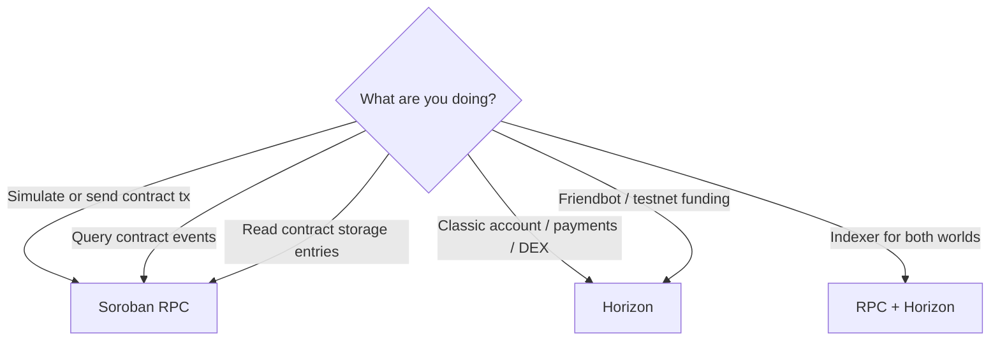

# RPC vs Horizon

Stellar applications often need **two** HTTP APIs:

- **Soroban RPC** — smart-contract simulation, transaction submission for Soroban, ledger entries, and contract events
- **Horizon** — classic ledger resources: accounts, payments, operations, effects, order books, and historical classic data

Use this page to choose the right API for simulation, events, and classic ops.

## Quick decision table

| Use case | Prefer | Why |
| --- | --- | --- |
| `simulateTransaction` for contract calls | **Soroban RPC** | Simulation is a Soroban RPC concern (`simulateTransaction`) |
| Prepare / assemble Soroban transactions | **Soroban RPC** | Footprints, auth, resource fees come from simulation |
| Submit Soroban contract invocations | **Soroban RPC** (or tooling that wraps it) | Contract tx lifecycle is RPC-oriented |
| Contract events (`getEvents`, topic filters) | **Soroban RPC** | Contract event APIs live on RPC |
| Read contract instance / persistent entries | **Soroban RPC** (`getLedgerEntries`) | Direct Sac/contract storage access |
| Account balances, signers, classic trustlines | **Horizon** | Classic account model |
| Payments, path payments, claimable balances | **Horizon** | Classic operations & effects |
| Streaming classic payments / operations | **Horizon** streams | Mature classic streaming |
| Trade aggregation / order books | **Horizon** | DEX classic endpoints |
| Historical analytics mixing classic + contracts | **Both** | Join off-chain by tx hash / ledger |
| Health checks in local cookbook scripts | Often **RPC** for contracts; **Horizon** for friendbot/account | Match the failing layer |



## Soroban RPC responsibilities

Typical RPC methods (names stable across providers; see official docs for schemas):

| Method | Role |
| --- | --- |
| `simulateTransaction` | Dry-run a transaction; returns results, auth, footprint, resource estimates |
| `sendTransaction` | Submit a signed transaction |
| `getTransaction` | Poll transaction status |
| `getEvents` | Fetch contract events by ledger range and topics |
| `getLedgerEntries` | Read on-ledger entries (including contract data) |
| `getHealth` / `getNetwork` | Liveness and network passphrase |

Official documentation:

- [Soroban RPC](https://developers.stellar.org/docs/data/rpc)
- [RPC methods reference](https://developers.stellar.org/docs/data/rpc/api-reference)
- [`simulateTransaction`](https://developers.stellar.org/docs/data/rpc/api-reference/methods/simulateTransaction)
- [`getEvents`](https://developers.stellar.org/docs/data/rpc/api-reference/methods/getEvents)

### When simulation matters

Always simulate before production submission when:

- Building contract invocations with unknown footprints
- Refreshing auth entries
- Estimating fees/resources
- Debugging host errors without paying for a failed tx on-chain

CLI example:

```bash
# Many stellar CLI flows call RPC simulation under the hood
stellar contract invoke \
  --id "$CONTRACT_ID" \
  --network testnet \
  --source-account <G_OR_ALIAS> \
  -- send --help
```

Point `STELLAR_RPC_URL` / config at a testnet RPC such as a public endpoint or your own node. See [Debugging Guide](../getting-started/debugging.md) for environment checks (`SOROBAN_RPC_URL` / CLI network config).

## Horizon responsibilities

Horizon exposes classic REST resources, for example:

| Resource | Examples |
| --- | --- |
| Accounts | Balances, sequence numbers, signers |
| Transactions / operations / effects | Classic history |
| Payments | Native and credit payments |
| Assets / order books / trades | Classic DEX |
| Streams | `cursor`-based streaming |

Official documentation:

- [Horizon](https://developers.stellar.org/docs/data/horizon)
- [Horizon API reference](https://developers.stellar.org/docs/data/horizon/api-reference)

Friendbot (testnet funding) is conventionally reached via Horizon-style URLs, not Soroban RPC.

## Events: RPC first

For **contract** events emitted via `env.events().publish(...)`:

1. Prefer Soroban RPC `getEvents` with topic filters.
2. Store cursor/ledger checkpoints in your indexer.
3. Do not expect Horizon's classic `/operations` feed to replace contract event semantics.

For **classic** payment notifications, Horizon streams remain appropriate.

Cross-link: [Events concept page](./events.md).

## Classic ops vs contract ops

| Layer | API | Examples |
| --- | --- | --- |
| Classic | Horizon | `payment`, `changeTrust`, `manageSellOffer` |
| Smart contract | Soroban RPC | `invokeHostFunction`, simulation footprint |
| Hybrid apps | Both | Wallet shows classic balances (Horizon) + contract positions (RPC entries/events) |

Submitting a Soroban transaction through tooling that only understands Horizon classic endpoints will fail. Likewise, reading SAC balances via Horizon trustlines is **not** the same as reading SAC contract balances through token interfaces (though classic balances remain relevant for unwrapped holdings).

## Practical cookbook guidance

1. Configure **network passphrase**, **RPC URL**, and **Horizon URL** separately per environment.
2. Use RPC for `simulateTransaction` + contract events in CI smoke tests.
3. Use Horizon for account funding checks and classic sequence numbers when building mixed transactions.
4. On failures, see [Debugging Guide](../getting-started/debugging.md) — verify RPC URL first for contract errors, Horizon for account/sequence issues.

## Related reading

- [Events](./events.md)
- [Debugging Guide](../getting-started/debugging.md)
- [Stellar Asset Contract (SAC)](./stellar-asset-contract.md)
- [Soroban RPC docs](https://developers.stellar.org/docs/data/rpc)
- [Horizon docs](https://developers.stellar.org/docs/data/horizon)

## Next

- [Events](./events.md)
- [Debugging Guide](../getting-started/debugging.md)
- [Gas and Resources](./gas-and-resources.md)
