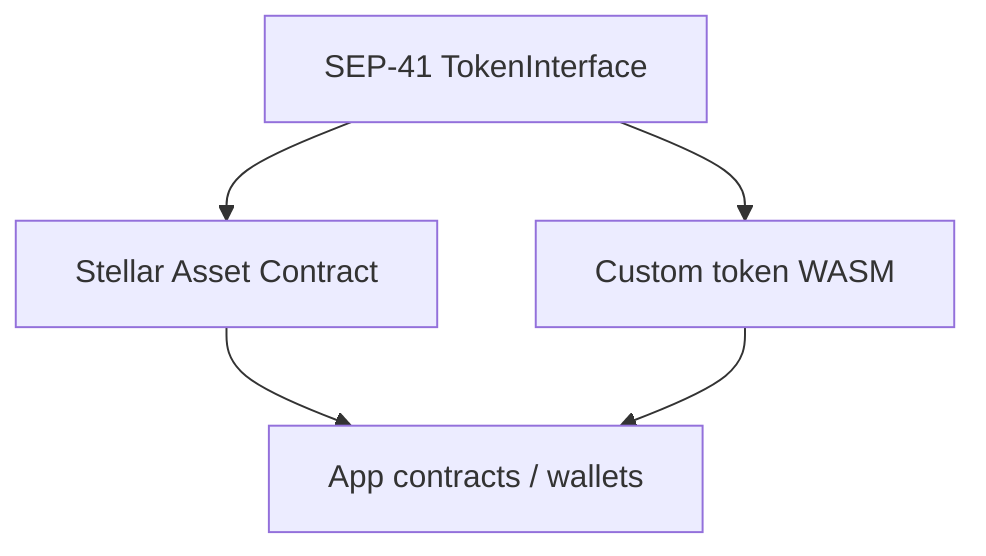

# SEP-41 Token Standard

[SEP-41](https://github.com/stellar/stellar-protocol/blob/master/ecosystem/sep-0041.md) defines the **fungible token interface** for Soroban. The Rust surface is exposed as `soroban_sdk::token::TokenInterface`. Both the [Stellar Asset Contract (SAC)](./stellar-asset-contract.md) and custom token contracts can implement this interface so wallets, DEXes, and app contracts share one calling convention.

This page summarizes the interface, metadata, capabilities, and how the SEP maps to real deployments.

## Why SEP-41 exists

Without a shared interface, every token would invent incompatible `transfer` / `balance` shapes. SEP-41 standardizes:

- Balance and allowance queries
- Approvals with explicit expiry ledgers
- Transfers and delegated `transfer_from`
- Burns and delegated `burn_from`
- Metadata (`decimals`, `name`, `symbol`)
- Recommended event topics for indexers

## Interface method summary

| Method | Auth expectation | Purpose |
| --- | --- | --- |
| `allowance(from, spender) -> i128` | None (read) | Remaining allowance for `spender` over `from`'s balance |
| `approve(from, spender, amount, live_until_ledger)` | `from.require_auth()` | Set allowance until a ledger (inclusive semantics per spec); `amount = 0` clears |
| `balance(id) -> i128` | None (read) | Token balance for `id` (`0` if unset) |
| `transfer(from, to, amount)` | `from.require_auth()` | Move `amount` from `from` to `to` (`to` may be a muxed address in current specs) |
| `transfer_from(spender, from, to, amount)` | `spender.require_auth()` | Delegated transfer consuming allowance |
| `burn(from, amount)` | `from.require_auth()` | Destroy `amount` from `from` |
| `burn_from(spender, from, amount)` | `spender.require_auth()` | Delegated burn consuming allowance |
| `decimals() -> u32` | None (read) | Display decimals |
| `name() -> String` | None (read) | Human-readable name |
| `symbol() -> String` | None (read) | Ticker symbol |

Source of truth:

- SEP text: [stellar-protocol `sep-0041.md`](https://github.com/stellar/stellar-protocol/blob/master/ecosystem/sep-0041.md)
- Stellar docs: [Token interface](https://developers.stellar.org/docs/tokens/token-interface)
- SDK trait: [`TokenInterface`](https://docs.rs/soroban-sdk/latest/soroban_sdk/token/trait.TokenInterface.html)

:::note Spec drift
SEP-41 and the SDK evolve (for example muxed `to` addresses and richer event payloads). Prefer the current SEP and `soroban-sdk` docs when generating clients.
:::

## Metadata fields

| Field | Type | Notes |
| --- | --- | --- |
| `decimals` | `u32` | UI scaling factor; not a substitute for fixed-point safety in contract math |
| `name` | `String` | Long display name |
| `symbol` | `String` | Short ticker |

SAC metadata reflects the underlying classic asset. Custom tokens choose values that wallets will show; keep them stable after launch when possible.

## Allowances

`approve` sets how many tokens `spender` may move via `transfer_from` / `burn_from`.

- `live_until_ledger` must be understood relative to the current ledger; expired allowances behave as zero.
- Setting `amount` to `0` is the standard clear path.
- Implementations should not change expiry unexpectedly when consuming allowance on `transfer_from` (consume amount, keep expiry per SEP semantics).

## Transfers, burns, and minting

| Capability | In SEP-41? | Notes |
| --- | --- | --- |
| `transfer` / `transfer_from` | Yes | Core movement APIs |
| `burn` / `burn_from` | Yes | Supply reduction by holder or spender |
| `mint` | **No** (base SEP-41) | SAC and custom tokens may add mint as an extension/admin API |
| Clawback / authorization flags | SAC extensions | Classic asset controls mirrored on SAC |

Application contracts that need mint/burn policy should either use SAC admin capabilities or implement audited custom methods **in addition to** SEP-41—not replace the standard transfer/balance surface.

## Recommended events

Indexers commonly expect topics such as:

| Action | Typical topics | Data |
| --- | --- | --- |
| Approve | `["approve", from, spender]` | `amount`, `live_until_ledger` |
| Transfer | `["transfer", from, to]` | `amount` (and muxed metadata when applicable) |
| Burn | `["burn", from]` | `amount` |

Emit events after successful state changes so off-chain consumers can reconcile without re-simulating every transaction. See [Events](./events.md).

## Alignment with SAC and custom tokens

| Implementation | SEP-41 | Extra APIs |
| --- | --- | --- |
| SAC | Yes | Admin/mint/clawback/authorization helpers |
| OpenZeppelin-style fungible modules | Yes (via helpers) | Optional allowlist/blocklist extensions |
| Minimal cookbook demos | Often partial | Teaching subsets — production tokens should complete SEP-41 |

## Implementation checklist

- [ ] Implement all SEP-41 methods clients will call (do not omit `approve` / `transfer_from` if you advertise SEP-41).
- [ ] Enforce `require_auth` on the correct party for every mutating method.
- [ ] Reject negative amounts and overdrafts consistently.
- [ ] Document mint/clawback separately if you add them.
- [ ] Provide testnet contract IDs and verify wallet transfer flows.
- [ ] Prefer SAC when representing classic Stellar assets ([SAC deep-dive](./stellar-asset-contract.md)).

## Related reading

- [Token Standards Overview](./token-standards.md)
- [Stellar Asset Contract (SAC)](./stellar-asset-contract.md)
- [Authorization](./authorization.md)
- [SEP-41 on GitHub](https://github.com/stellar/stellar-protocol/blob/master/ecosystem/sep-0041.md)

## Next

- [Stellar Asset Contract (SAC)](./stellar-asset-contract.md)
- [Token Standards Overview](./token-standards.md)
- [Events](./events.md)
