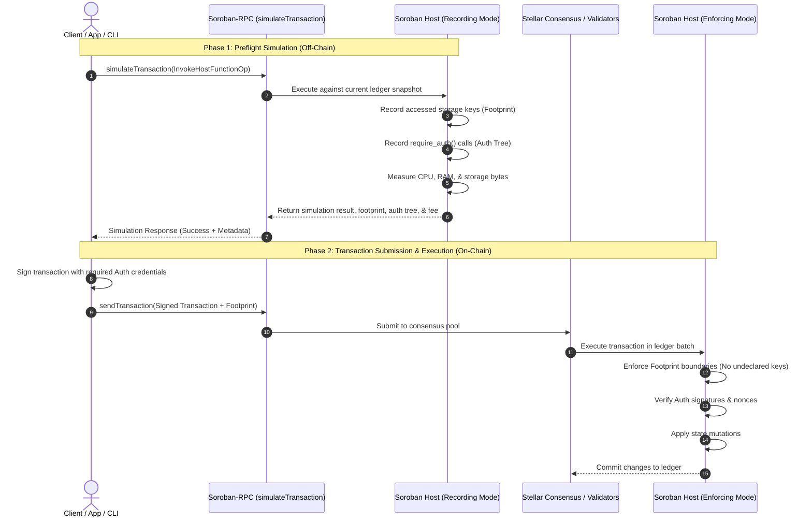

# Simulation and Footprints

In Soroban, smart contract execution follows a **two-phase transaction lifecycle**: an off-chain **Preflight Simulation** followed by an on-chain **Transaction Execution**. 

Unlike blockchains where transactions declare only a target address and gas limit, Soroban requires every transaction to explicitly declare its **Ledger Footprint** (the exact set of storage keys it reads or modifies) and resource limits (CPU instructions, memory bytes, read/write bytes, and storage rent) before it is submitted to the network.

Understanding how preflight simulation generates these footprints—and why an invocation that succeeds in simulation can still fail on-chain—is critical for building reliable applications. Footprint mismatches are the single most common cause of contract invocation failures after authorization errors.

---

## The Two-Phase Invocation Lifecycle

Every state-modifying Soroban transaction moves through two distinct environments:



### Phase 1: Preflight Simulation (`simulateTransaction`)

Before submitting a transaction, the client sends an unexecuted `InvokeHostFunctionOp` to a Soroban-RPC node via the `simulateTransaction` endpoint. The RPC node runs the contract code locally inside a read-only instance of the Soroban Host against the latest ledger snapshot:

1. **State Discovery:** The host traces all contract data entries, code entries, and TTL records touched during execution.
2. **Footprint Assembly:** It constructs the `LedgerFootprint` containing the minimal `readOnly` and `readWrite` keys needed.
3. **Auth Tree Recording:** It records every authorization check (`require_auth`) encountered in the execution call tree.
4. **Resource Measurement:** It computes exact CPU instructions, memory bytes, read/write byte sizes, and required storage rent fees.
5. **Result Preview:** It returns the function's return value (or contract error if it failed).

### Phase 2: On-Chain Execution (`sendTransaction`)

The client inspects the simulation response, attaches required cryptographic signatures to the auth tree, packages the transaction with the generated footprint and resource limits, and submits it via `sendTransaction`.

When validators include the transaction in a ledger, the Soroban Host executes the contract in **strict enforcing mode**:
- It permits access **only** to the ledger keys declared in the transaction's footprint.
- It validates all signed authorization entries against account public keys and nonces.
- If execution finishes within the declared resource limits, all state changes are atomically committed to the ledger.

---

## Defining the Footprint (`LedgerFootprint`)

A **Footprint** is the formal declaration of all ledger entries that a transaction needs to read or write during its execution.

In the Stellar XDR specification, a `LedgerFootprint` is composed of two disjoint sets of `LedgerKey` references:

```text
struct LedgerFootprint {
    readOnly:  Vec<LedgerKey>,
    readWrite: Vec<LedgerKey>,
}
```

### 1. `readOnly` Entries

Keys that the transaction reads but does not modify during execution:
- **Contract Code (`ContractCodeEntry`):** The compiled WASM bytecode of the contract and any foreign contracts called.
- **Contract Instance (`ContractDataEntry` instance):** Executable metadata, contract configuration, and instance storage keys that are only inspected.
- **Foreign State:** Balances or configuration data on other contracts that are read without being modified.

> **Concurrency benefit:** Multiple transactions in the same ledger can have overlapping `readOnly` footprints without conflicting.

### 2. `readWrite` Entries

Keys that the transaction creates, updates, deletes, or extends TTL for:
- **Instance Storage:** Contract-scoped state modified during execution.
- **Persistent & Temporary Storage:** User balances, mappings, orders, or records created or mutated.
- **TTL Entries (`TTLEntry`):** Storage lifetime records extended as part of the transaction rent payment.

### Why Soroban Requires Upfront Footprints

Traditional smart contract platforms execute transactions sequentially or dynamic-lock state during execution. Soroban requires footprints upfront for three architectural reasons:

1. **Deterministic Parallel Execution:** Validators inspect transaction footprints before execution. Non-overlapping transactions (transactions whose `readWrite` sets do not intersect each other's `readOnly` or `readWrite` sets) can be executed concurrently across multiple CPU threads.
2. **Deterministic Resource Pricing:** Because the exact size and number of ledger entries are declared prior to execution, state access fees and storage rent are calculated deterministically.
3. **State Contention Prevention:** Validators can detect state conflicts prior to running computationally expensive logic.

---

## Authorization Modes in Preflight vs. Execution

Soroban's authorization framework uses different operating modes depending on whether the contract is running in preflight simulation or on-chain execution:

| Stage | Mode | Host Behavior |
| --- | --- | --- |
| **Simulation** | **Recording Mode** | Host bypasses signature verification. It records every `require_auth` / `require_auth_for_args` call and builds a structured **Auth Tree** (`SorobanAuthorizationEntry`). |
| **Client Assembly** | **Signing Mode** | Client inspects the recorded auth tree and generates valid credentials (cryptographic signatures or custom contract auth proofs) for all required addresses. |
| **On-Chain Execution** | **Enforcing Mode** | Host validates that every `require_auth` call matches an entry in the transaction's signed authorization tree. Verifies signatures, nonces, and validity windows. |

### Types of Authorization Entries

1. **Invoker Authorization (`InvokerContractAuthEntry`):**
   - When the transaction's source account is the direct caller and signer. No separate sub-signature is required because the top-level transaction envelope signature authorizes the call.
2. **Direct Account Authorization (`AddressWithNonce` / Ed25519 Signer):**
   - Required when an account (other than the sole invoker or in a complex sub-invocation) must authorize an action (e.g., token transfer). The account signs an authorization preimage containing contract ID, function name, arguments, nonce, and expiration ledger.
3. **Custom Account Contract Authorization (Smart Wallets):**
   - For contracts acting as accounts (e.g., multi-sig contracts, passkey wallets). The host invokes the account contract's `__check_auth` function during on-chain execution to verify credentials.

---

## Why Simulation Success Can Still Fail On-Chain

A common point of confusion for developers is when `simulateTransaction` returns a successful result with `status: SUCCESS`, but the submitted transaction fails on-chain.

Because simulation is an off-chain preview evaluated against a snapshot in time, **any discrepancy between the snapshot state and the consensus state will cause on-chain failure**.

### 1. Footprint Mismatch (State Drift & Race Conditions)

**This is the #1 cause of contract invocation failures after authorization issues.**

A footprint mismatch occurs when the contract's on-chain execution path attempts to read or write a ledger entry that was **not** included in the transaction's preflight footprint.

#### How It Happens:
1. At ledger $N$, the client simulates the transaction. The contract takes code path A and reads keys $\{K_1, K_2\}$. The simulation generates a footprint containing $\{K_1, K_2\}$.
2. Between ledger $N$ and ledger $N+k$ (when the transaction is processed), another user's transaction modifies the ledger state.
3. At ledger $N+k$, the contract executes on-chain. Due to the state change, the contract logic branches into code path B and attempts to read key $K_3$.
4. **Host Trap:** The Soroban Host detects an access attempt to $K_3$, which is absent from the declared footprint. The host immediately terminates execution with `HostError: Error(Storage, MissingValue)` or a footprint violation.

```mermaid
graph TD
    subgraph Preflight at Ledger N
        SimIn["Invoke contract"] --> BranchA["State condition = true (Path A)"]
        BranchA --> Key1["Access Key 1 & Key 2"]
        Key1 --> FP["Footprint declared: [Key 1, Key 2]"]
    end

    subgraph Consensus at Ledger N+1
        OtherTx["Concurrent transaction changes condition to false"]
    end

    subgraph On-Chain Execution at Ledger N+2
        ExecIn["Execute with Footprint [Key 1, Key 2]"] --> BranchB["State condition = false (Path B)"]
        BranchB --> Key3["Attempt to access Key 3"]
        Key3 --> Trap["HOST ERROR: Key 3 NOT in Footprint!"]
        Trap --> FailedTx["Transaction FAILS on-chain"]
    end
```



### 2. Storage Entry Expiration (TTL Expiry)

All Soroban storage entries (persistent and temporary) have a Time-To-Live (TTL) measured in ledgers. If an entry is close to expiration and passes its TTL before the transaction reaches consensus:
- During simulation, the entry was active and readable.
- On-chain, the entry is archived or deleted.
- Accessing it on-chain fails with a storage missing value error.

### 3. Resource Budget & Instruction Drift

During simulation, the RPC node measures CPU instructions and RAM usage based on the snapshot state. If on-chain state has grown (e.g., an order book has more items to iterate through, or a dynamic array has expanded), the contract consumes more CPU or memory on-chain than was declared in the transaction header, resulting in an `ExceededBudget` error.

### 4. Nonce Invalidation and Sequence Mismatches

If the account or smart wallet submitted another transaction in the interim, the authorization nonce or transaction sequence number will already have been consumed, causing an on-chain authorization replay rejection.

### 5. Time-Dependent and Ledger-Dependent Logic

Contracts that branch based on `env.ledger().timestamp()` or `env.ledger().sequence()` (such as auctions, streaming vesting schedules, or slippage deadlines) can evaluate to different execution branches on-chain if the ledger timestamp advances past a boundary condition.

---

## Real-World Example: Failed Footprint Mismatch (Redacted)

Consider a decentralized exchange router that dynamically selects between two liquidity pools (`Pool_A` and `Pool_B`) based on which pool offers the best price:

```rust
// Contract logic: Dynamic pool routing
#[contractimpl]
impl Router {
    pub fn swap(env: Env, token_in: Address, token_out: Address, amount: i128) {
        // Dynamic lookup: selects pool based on current reserve ratio
        let best_pool_address: Address = get_best_pool(&env, &token_in, &token_out);

        // Access the selected pool's persistent storage
        let pool_data: PoolData = env
            .storage()
            .persistent()
            .get(&best_pool_address)
            .unwrap();

        // Perform swap on best pool...
    }
}
```

### Step 1: Preflight Simulation (Success)

- **Snapshot State:** `Pool_A` has higher liquidity and is selected by `get_best_pool`.
- **RPC Simulation Output:**
  ```json
  {
    "status": "SUCCESS",
    "results": [
      {
        "auth": [],
        "xdr": "AAAA..."
      }
    ],
    "transactionData": {
      "resources": {
        "footprint": {
          "readOnly": [
            "ContractCodeEntry",
            "RouterInstance"
          ],
          "readWrite": [
            "ContractDataEntry(Pool_A)",
            "UserDataEntry(User_Balance)"
          ]
        },
        "instructions": 2450000,
        "readBytes": 4120,
        "writeBytes": 1280
      }
    }
  }
  ```

### Step 2: Concurrent State Change On-Chain

Before the user's transaction is included in a block, another trader executes a massive swap on `Pool_A`, shifting the price curve.

### Step 3: On-Chain Execution (Footprint Failure)

When the user's transaction executes on-chain:
1. `get_best_pool` evaluates against the new reserve state and selects `Pool_B`.
2. The contract executes `env.storage().persistent().get(&Pool_B)`.
3. The Soroban Host checks the transaction footprint: `ContractDataEntry(Pool_B)` is **absent** from `readWrite` and `readOnly`.
4. Execution halts immediately with a host panic.

#### Diagnostic Error Log:

```json
{
  "status": "FAILED",
  "resultXdr": "AAAAAAAAAGT/////AAAAAwAAAAAAAAAAAAAA...",
  "error": "HostError: Error(Storage, MissingValue)",
  "diagnosticEvents": [
    {
      "type": "diagnostic",
      "topics": ["error", "storage_access_violation"],
      "data": "Attempted to access undeclared persistent key [Pool_B] not in transaction footprint"
    }
  ]
}
```

---

## Best Practices & Mitigation Strategies

To prevent footprint mismatches and simulation-vs-reality failures in production:

### 1. Pass Dynamic Dependencies as Explicit Arguments

Avoid discovering target contracts or storage keys dynamically on-chain when they can be determined on the client:

```rust
// AVOID: Dynamic on-chain key discovery
pub fn swap(env: Env, token_in: Address, token_out: Address, amount: i128)

// PREFERRED: Pass target pool explicitly from client preflight
pub fn swap_direct(env: Env, pool: Address, token_in: Address, amount: i128, min_out: i128)
```

When `pool` is passed as a parameter, the client's simulation footprint matches the on-chain execution target deterministically. If market conditions change such that the trade is no longer favorable, the contract can gracefully revert on slippage rather than failing on an undeclared storage footprint trap.

### 2. Minimize Simulation-to-Submission Latency

In frontends and backend services, minimize the delay between calling `simulateTransaction` and calling `sendTransaction`. Do not store simulation payloads across user sessions or long async queues.

### 3. Implement Automatic Resimulation on Mismatch

When an invocation fails with `Error(Storage, MissingValue)` or a footprint-related transaction error code:
1. Re-fetch the latest ledger state.
2. Re-simulate the transaction to generate a refreshed footprint and updated auth tree.
3. Re-sign and re-submit the transaction.

### 4. Maintain Storage TTLs Proactively

Ensure persistent contract entries have sufficient TTL buffers before invoking sensitive functions. Use `env.storage().persistent().extend_ttl()` inside contracts or execute `ExtendFootprintTTLOp` transactions periodically for critical infrastructure entries.

### 5. Add Safety Buffers to Resource Estimates

When building transactions from simulation data, SDKs allow adding a percentage buffer to CPU instructions and memory limits (e.g., 10–20% margin) to absorb minor state variations between blocks without exceeding gas budgets.

---

## Related links

- [Contract Interaction Tutorial](/docs/getting-started/contract-interaction) — invoking contracts from CLI and app backends
- [Gas and Resource Management](/docs/concepts/gas-and-resources) — understanding compute and storage budgets
- [Storage Patterns](/docs/concepts/storage) — instance, persistent, and temporary storage lifecycles
- [Authorization Concept](/docs/concepts/authorization) — Soroban identity and access control patterns
- [Debugging Guide](/docs/getting-started/debugging) — troubleshooting failed invocations and diagnostic events
