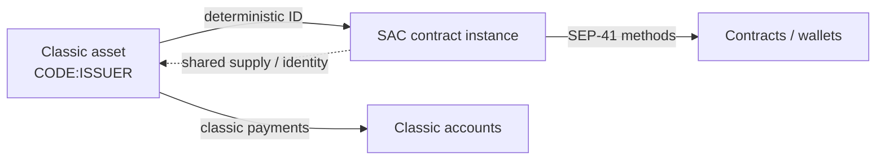

# Stellar Asset Contract (SAC)

The **Stellar Asset Contract (SAC)** is the protocol-provided Soroban contract that represents a classic Stellar asset (including native XLM) under the [SEP-41](./sep-41-token-standard.md) token interface. Every classic asset has a deterministic SAC instance: you do not deploy bespoke WASM for ordinary Stellar assets.

Use this page when you need wrapping mechanics, SAC ID calculation, admin/authority behavior, CLI examples for testnet, and a clear rule for when **not** to write a custom token.

## Classic assets vs SAC

| Concept | Classic Stellar | Soroban SAC |
| --- | --- | --- |
| Asset identity | `Code:Issuer` (or native) | Contract ID derived from the asset |
| Balances | Trustlines / native balance | SAC balance interface (`balance`, `transfer`, …) |
| Authorization | Classic ops + account flags | SEP-41 methods + SAC admin extensions |
| Interop | Horizon / classic SDKs | Soroban RPC + token clients |

Wrapping does not create a second economic asset. It exposes the **same** classic asset through the SAC interface so smart contracts and wallets can call standardized token methods.



## How SAC IDs are determined

SAC contract IDs are **deterministic** from the network's passphrase and the asset. Given the same network and asset, every participant computes the same contract ID.

### Retrieve or compute a SAC ID (CLI)

With Stellar CLI (testnet example — no secrets required):

```bash
# Native XLM SAC on the configured network
stellar contract id asset \
  --asset native \
  --network testnet

# Issued asset SAC (replace ISSUER with the asset's G-address)
stellar contract id asset \
  --asset "USDC:ISSUER" \
  --network testnet
```

Notes:

- Replace the issuer with the real G-address for your asset.
- `--network testnet` selects the testnet network passphrase used in the ID derivation.
- You can pass an explicit `--network-passphrase` when not using a named network config.
- Older docs may show `soroban` as the CLI binary name; current Stellar CLI uses `stellar`.

### Deploy / wrap references (testnet)

The SAC WASM is built into the protocol. "Deploying" for a classic asset typically means **ensuring the SAC instance exists** (wrap) rather than uploading custom token WASM.

```bash
# Example: wrap/create the SAC instance for an asset on testnet
# (exact subcommand naming can vary slightly by CLI version — check `stellar contract --help`)
stellar contract asset deploy \
  --asset "USDC:ISSUER" \
  --network testnet \
  --source-account <G_ADDRESS_OR_ALIAS>

# After wrap, read the ID again for clients and configs
stellar contract id asset \
  --asset "USDC:ISSUER" \
  --network testnet
```

:::tip No secrets in docs
Use funded testnet keys from your local CLI config or ephemeral lab accounts. Never commit seed phrases, secret keys, or production admin seeds.
:::

Official references:

- [Stellar Asset Contract](https://developers.stellar.org/docs/tokens/stellar-asset-contract)
- [Token interface (SEP-41)](https://developers.stellar.org/docs/tokens/token-interface)
- [Stellar CLI](https://developers.stellar.org/docs/tools/cli)

## Admin authority and SAC controls

Beyond the SEP-41 surface, SAC exposes asset-administration semantics familiar from classic Stellar, including (as applicable to the asset's flags and setup):

| Capability | Purpose |
| --- | --- |
| `mint` | Issue units (issuer / admin pathways as defined by SAC) |
| `clawback` | Recall units when clawback is enabled |
| `set_admin` | Rotate SAC admin |
| `set_authorized` / authorization flags | Gate holders when authorization-required style controls apply |
| `decimals` / `name` / `symbol` | Metadata aligned with the asset |

Admin mistakes (lost admin keys, overly privileged operators) affect the **classic asset ecosystem**, not just one custom contract. Treat SAC admin keys with the same care as issuer keys.

## Trade-offs vs custom tokens

| Dimension | SAC | Custom token contract |
| --- | --- | --- |
| Compatibility | Default path for wallets and indexers | Requires explicit integrations |
| Correctness risk | Protocol-maintained | Your mint/burn/auth bugs |
| Flexibility | Standard SAC + classic flags | Arbitrary policy |
| Ops model | Issuer / classic controls | Contract upgrade + custom admin |
| Time to ship | Fast for standard assets | Higher engineering cost |

## When NOT to write a custom token

Prefer SAC (and classic issuance) when:

1. You are representing a normal fungible asset that already exists—or should exist—as a Stellar classic asset.
2. You want wallet, exchange, and ecosystem tooling to recognize the asset without a custom adapter.
3. Your "custom logic" is really **application** logic (vesting, AMMs, escrow) that can hold/transfer SAC balances via SEP-41 instead of reimplementing balances.
4. You need clawback, authorization-required, or issuer controls already modeled in classic Stellar.
5. You do not want to maintain token WASM, storage layouts, and audit surface for balances.

Write a custom token only when you need non-SEP-41 semantics that cannot live in a separate app contract (unusual accounting units, tightly coupled hooks on every transfer that cannot be enforced via allowance/transfer wrappers, experimental interfaces). Even then, consider implementing SEP-41 *and* extensions so integrators still see a standard balance/transfer API.

See also: [Token Standards Overview](./token-standards.md) and [SEP-41 Token Standard](./sep-41-token-standard.md).

## Practical integration tips

- Store the SAC contract ID in config per network (testnet/mainnet IDs differ).
- In contracts, use `soroban_sdk::token` clients against the SAC ID rather than hard-coding custom balance maps for Stellar assets.
- Test wrap + transfer on testnet before mainnet issuer operations.
- Document whether your product speaks classic payments, SAC transfers, or both.

## Related reading

- [Token Standards Overview](./token-standards.md)
- [SEP-41 Token Standard](./sep-41-token-standard.md)
- [Authorization](./authorization.md)
- [Stellar developers: SAC](https://developers.stellar.org/docs/tokens/stellar-asset-contract)

## Next

- [SEP-41 Token Standard](./sep-41-token-standard.md)
- [Token Standards Overview](./token-standards.md)
- [RPC and Horizon](./rpc-and-horizon.md)
