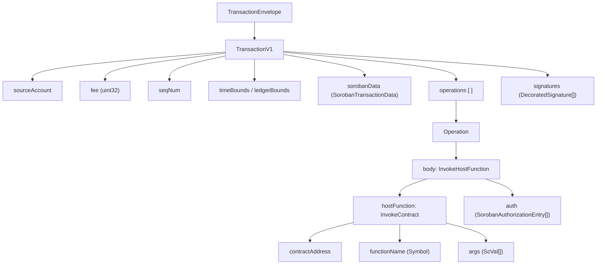

# Transaction Anatomy: Invoking a Contract

When you run `stellar contract invoke`, the CLI quietly builds and submits a Stellar **transaction** on your behalf. This page opens that black box: you will see the exact XDR structure of the `InvokeHostFunction` operation, follow a step-by-step CLI walkthrough that captures and decodes XDR at each stage, and learn how to inspect any invoke transaction in Stellar Lab.

## Why this matters

Stellar-native developers already think in terms of operations and transactions. Soroban is not a separate network — every contract call is an ordinary Stellar transaction that contains an `InvokeHostFunction` operation. Understanding this lets you:

- Build multi-operation transactions that mix classic Stellar operations with contract calls.
- Integrate custom signers, hardware wallets, or multi-sig workflows.
- Debug fee and authorization errors by reading the raw XDR.
- Verify exactly what the network will execute before signing.

## Transaction anatomy

Every Stellar transaction that calls a contract follows the same envelope hierarchy:



### XDR field reference

| Field | XDR type | Description |
|---|---|---|
| `sourceAccount` | `MuxedAccount` | The classic or muxed account paying the fee and sequence number |
| `fee` | `uint32` | Base fee in stroops; Soroban adds a resource fee on top |
| `seqNum` | `SequenceNumber` | Must be exactly `sourceAccount.seqNum + 1` |
| `sorobanData` | `SorobanTransactionData` | Resource limits (CPU, memory, ledger I/O) and footprint |
| `sorobanData.resourceFee` | `int64` | Maximum resource fee the submitter is willing to pay |
| `sorobanData.resources.footprint.readOnly` | `LedgerKey[]` | Ledger entries the contract reads but does not write |
| `sorobanData.resources.footprint.readWrite` | `LedgerKey[]` | Ledger entries the contract may write |
| `InvokeHostFunction.hostFunction` | `HostFunction` | Discriminated union — `INVOKE_CONTRACT` variant used here |
| `InvokeContractArgs.contractAddress` | `ScAddress` | The deployed contract ID as an `ScAddress` |
| `InvokeContractArgs.functionName` | `ScSymbol` | Name of the contract function to call |
| `InvokeContractArgs.args` | `ScVal[]` | Positional arguments encoded as Soroban values |
| `auth` | `SorobanAuthorizationEntry[]` | Authorization signatures for contract-level auth checks |

> [!NOTE]
> A single transaction may contain **at most one** `InvokeHostFunction` operation. You cannot batch multiple contract calls into one transaction, but you can combine a contract call with classic operations such as `Payment` or `ChangeTrust` in the same transaction.

## Prerequisites

- Stellar CLI installed (`cargo install --locked stellar-cli` or `brew install stellar-cli`)
- A funded testnet account configured in Stellar CLI
- A deployed hello-world contract on testnet — follow [Deploy to Testnet](./deploy-testnet) first

```bash
# Confirm your setup
stellar --version
stellar keys list
stellar network ls
```

## CLI walkthrough

We will invoke the `hello` function of the hello-world contract and inspect the XDR at every step. Set your environment variables first:

```bash
export NETWORK=testnet
export SOURCE=my-testnet-account
export CONTRACT_ID=<your-contract-id>
```

### Step 1 — Simulate the transaction

Simulation calls the RPC node's `simulateTransaction` endpoint without broadcasting anything. The node executes the contract in a sandbox and returns the resource footprint and recommended fee.

```bash
stellar contract invoke \
  --id "$CONTRACT_ID" \
  --source "$SOURCE" \
  --network "$NETWORK" \
  --build-only \
  -- hello --to World
```

The `--build-only` flag stops after simulation and prints the assembled (but unsigned) transaction XDR to stdout. Save it:

```bash
UNSIGNED_XDR=$(stellar contract invoke \
  --id "$CONTRACT_ID" \
  --source "$SOURCE" \
  --network "$NETWORK" \
  --build-only \
  -- hello --to World)

echo "$UNSIGNED_XDR"
```

Expected output — a long base64-encoded XDR string beginning with `AAAA...`.

### Step 2 — Decode and inspect the transaction XDR

Decode the XDR to human-readable JSON to see the full structure:

```bash
stellar xdr decode \
  --type TransactionEnvelope \
  --output json-formatted \
  <<< "$UNSIGNED_XDR"
```

You should see output similar to:

```json
{
  "v1": {
    "tx": {
      "source_account": "GA...",
      "fee": 100,
      "seq_num": 1234567890,
      "operations": [
        {
          "body": {
            "invoke_host_function": {
              "host_function": {
                "invoke_contract": {
                  "contract_address": {
                    "contract_id": "C..."
                  },
                  "function_name": "hello",
                  "args": [
                    {
                      "symbol": "World"
                    }
                  ]
                }
              },
              "auth": []
            }
          }
        }
      ],
      "ext": {
        "soroban_data": {
          "resources": {
            "footprint": {
              "read_only": [ "..." ],
              "read_write": []
            },
            "instructions": 600000,
            "read_bytes": 0,
            "write_bytes": 0
          },
          "resource_fee": 420
        }
      }
    },
    "signatures": []
  }
}
```

Key things to note:
- `fee` is the **base fee** in stroops (100 stroops = 0.00001 XLM).
- `sorobanData.resource_fee` is the **resource fee** charged on top of the base fee.
- `signatures` is empty — this is before signing.
- `args[0]` is `{ "symbol": "World" }` — the argument encoded as an `ScVal`.

### Step 3 — Sign the transaction

Sign the assembled transaction with your account key:

```bash
SIGNED_XDR=$(stellar tx sign \
  --source "$SOURCE" \
  --network "$NETWORK" \
  <<< "$UNSIGNED_XDR")

echo "$SIGNED_XDR"
```

Decode again to confirm the signature was added:

```bash
stellar xdr decode \
  --type TransactionEnvelope \
  --output json-formatted \
  <<< "$SIGNED_XDR" | grep -A5 '"signatures"'
```

You should now see one `DecoratedSignature` entry with a `hint` (first 4 bytes of the public key) and a 64-byte `signature`.

### Step 4 — Submit the signed transaction

Submit the signed XDR to the network and capture the result:

```bash
stellar tx submit \
  --network "$NETWORK" \
  <<< "$SIGNED_XDR"
```

Expected output:

```
Transaction submitted successfully.
Transaction hash: abc123...
Ledger: 12345678
Result: ["Hello", "World"]
```

### Step 5 — Inspect the result XDR

The result XDR encodes the return value from the contract. Decode it to verify:

```bash
# Get the result XDR from the horizon response
RESULT_XDR="<result_meta_xdr_from_response>"

stellar xdr decode \
  --type TransactionResult \
  --output json-formatted \
  <<< "$RESULT_XDR"
```

## Stellar Lab walkthrough

[Stellar Lab](https://lab.stellar.org) provides a visual interface for building, signing, and submitting transactions. You can paste any transaction XDR to inspect or re-sign it.

### Inspect an unsigned transaction

1. Open [https://lab.stellar.org/transaction/build](https://lab.stellar.org/transaction/build) and select **Testnet**.
2. Click **"Import XDR"** and paste your `$UNSIGNED_XDR` value.
3. Lab will parse and display each field: source account, fee, sequence number, operations, and Soroban data.
4. Expand the **`InvokeHostFunction`** operation to see the contract address, function name, arguments, and auth entries.
5. Expand **Soroban Transaction Data** to review the resource limits and footprint.

### Sign and submit via Lab

1. On the **Sign** tab, enter your secret key (use testnet keys only — never paste mainnet keys into any web interface).
2. Click **Sign Transaction** — Lab adds the signature to the XDR.
3. Switch to the **Submit** tab and click **Submit Transaction**.
4. Lab displays the ledger sequence, transaction hash, and result XDR on success.

> [!IMPORTANT]
> Never paste a mainnet secret key into any web interface, including Stellar Lab. For mainnet, use the Stellar Lab **Keypair Signer** or a hardware wallet integration.

## Authorization entries

For contracts that require account authorization (e.g., token transfers), the `auth` field of `InvokeHostFunction` must contain signed `SorobanAuthorizationEntry` objects.

Each entry records:
- **credentials** — either `SourceAccount` (the transaction source) or `Address` (an explicit account, with a signature).
- **rootInvocation** — the contract call being authorized, including the function and arguments.

The Stellar CLI handles auth entry construction automatically when you use `stellar contract invoke`. For custom signers, you must:

1. Run simulation to get the `auth` entries that need to be signed.
2. Sign each `SorobanAuthorizationEntry` with the authorizing account's key.
3. Insert the signed entries back into the transaction before submitting.

Example — inspecting auth requirements from simulation output:

```bash
# Decode the simulated transaction to find auth entries
stellar xdr decode \
  --type TransactionEnvelope \
  --output json-formatted \
  <<< "$UNSIGNED_XDR" \
  | python3 -c "
import json, sys
env = json.load(sys.stdin)
auth = env['v1']['tx']['operations'][0]['body']['invoke_host_function']['auth']
print(json.dumps(auth, indent=2))
"
```

If `auth` is empty, the contract does not require explicit authorization (as with the hello-world function). If entries are present, each must be signed before the transaction is valid.

## Troubleshooting

### `tx_insufficient_fee`

The base fee or resource fee is too low.

```bash
# Re-simulate to get fresh resource estimates, then increase the fee cap
stellar contract invoke \
  --id "$CONTRACT_ID" \
  --source "$SOURCE" \
  --network "$NETWORK" \
  --fee 1000000 \
  -- hello --to World
```

### `txBAD_SEQ`

The sequence number in the transaction does not match the account's current sequence number.

```bash
# Check current sequence number
stellar account info --account "$SOURCE" --network "$NETWORK"
```

Rebuild the transaction — do not reuse stale XDR.

### `tx_failed` / `invoke_host_function_trapped`

The contract execution itself failed (a Rust `panic!` or `Err` return).

```bash
# Decode the result XDR for the error code
stellar xdr decode \
  --type TransactionResultMeta \
  --output json-formatted \
  <<< "$RESULT_META_XDR"
```

The `soroban_diagnostic_events` field (available when `--diagnostic-events` is passed to simulation) gives the full error stack.

### `tx_bad_auth` / auth entry missing

An authorization entry required by the contract is missing or has an invalid signature.

Re-run simulation, capture the required auth entries, sign each one, and rebuild.

### XDR decode fails

If `stellar xdr decode` errors with `unknown type`, ensure the `--type` flag matches the actual XDR envelope type. Common types:

| CLI flag | When to use |
|---|---|
| `TransactionEnvelope` | Full signed or unsigned transaction |
| `TransactionResult` | Result of a submitted transaction |
| `TransactionResultMeta` | Full result including ledger changes and events |
| `SorobanAuthorizationEntry` | A single auth entry |

## Summary

| Step | Command | What you get |
|---|---|---|
| Simulate | `stellar contract invoke --build-only` | Assembled unsigned XDR + resource estimates |
| Decode | `stellar xdr decode --type TransactionEnvelope` | Human-readable JSON of every field |
| Sign | `stellar tx sign` | Signed XDR with `DecoratedSignature` |
| Submit | `stellar tx submit` | Transaction hash + result |
| Inspect | Stellar Lab → Import XDR | Visual field-by-field view |

## Next steps

- **[Contract Interaction Tutorial](./contract-interaction)** — Higher-level CLI and SDK patterns
- **[Deploy to Testnet](./deploy-testnet)** — Full deployment workflow from WASM to live contract
- **[Authorization Concepts](../concepts/authorization)** — Deep dive into Soroban's auth model
- **[Cross-Contract Invocation](../concepts/cross-contract-invocation)** — How contracts call other contracts

## Additional resources

- [Stellar XDR Reference](https://developers.stellar.org/docs/data/xdr) — Complete XDR type definitions
- [Stellar Lab](https://lab.stellar.org) — Visual transaction builder and inspector
- [Soroban RPC `simulateTransaction`](https://developers.stellar.org/docs/data/rpc/api-reference/methods/simulateTransaction) — Simulation endpoint reference
- [Stellar CLI Reference](https://developers.stellar.org/docs/tools/cli) — All CLI commands and flags
