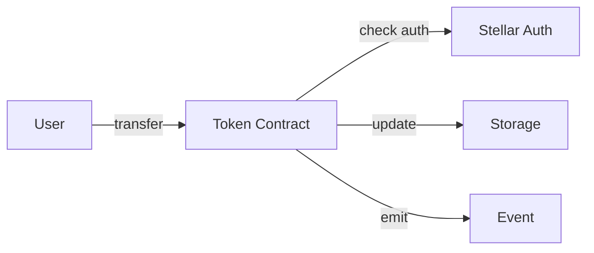

import PatternCard from '@site/src/components/PatternCard';

<PatternCard metadata={{
  title: "Basic Token Contract",
  description: "Implement a minimal fungible token with transfer and balance functions",
  difficulty: "intermediate",
  estimatedTime: "20 min",
  prerequisites: ["Storage Patterns", "Authentication"],
  solidityEquivalent: "ERC20",
  tags: ["token", "fungible", "standard"]
}}>

## Overview

This pattern implements a basic fungible token contract with:
- Token minting
- Balance tracking
- Transfer functionality
- Authorization checks

## Use Cases

- Creating custom project tokens
- Reward/loyalty programs
- Governance tokens
- In-app currency

## Architecture



## Implementation

### Contract Structure

```rust title="lib.rs"
#![no_std]
use soroban_sdk::{contract, contractimpl, contracttype, token, Address, Env, String};

#[contract]
pub struct Token;

#[contracttype]
#[derive(Clone)]
pub struct TokenMetadata {
    pub name: String,
    pub symbol: String,
    pub decimals: u32,
}

#[contractimpl]
impl Token {
    /// Initialize the token with metadata
    pub fn initialize(env: Env, admin: Address, metadata: TokenMetadata) {
        if env.storage().instance().has(&DataKey::Admin) {
            panic!("already initialized");
        }
        
        env.storage().instance().set(&DataKey::Admin, &admin);
        env.storage().instance().set(&DataKey::Metadata, &metadata);
    }
    
    /// Mint new tokens to an address
    pub fn mint(env: Env, to: Address, amount: i128) {
        let admin: Address = env.storage().instance().get(&DataKey::Admin).unwrap();
        admin.require_auth();
        
        let balance = Self::balance(env.clone(), to.clone());
        env.storage()
            .persistent()
            .set(&DataKey::Balance(to.clone()), &(balance + amount));
        
        env.events().publish(("mint", to), amount);
    }
    
    /// Transfer tokens from one address to another
    pub fn transfer(env: Env, from: Address, to: Address, amount: i128) {
        from.require_auth();
        
        let from_balance = Self::balance(env.clone(), from.clone());
        let to_balance = Self::balance(env.clone(), to.clone());
        
        if from_balance < amount {
            panic!("insufficient balance");
        }
        
        env.storage()
            .persistent()
            .set(&DataKey::Balance(from.clone()), &(from_balance - amount));
        env.storage()
            .persistent()
            .set(&DataKey::Balance(to.clone()), &(to_balance + amount));
        
        env.events().publish(("transfer", from, to), amount);
    }
    
    /// Get balance of an address
    pub fn balance(env: Env, address: Address) -> i128 {
        env.storage()
            .persistent()
            .get(&DataKey::Balance(address))
            .unwrap_or(0)
    }
    
    /// Get token metadata
    pub fn metadata(env: Env) -> TokenMetadata {
        env.storage().instance().get(&DataKey::Metadata).unwrap()
    }
}

#[contracttype]
pub enum DataKey {
    Admin,
    Metadata,
    Balance(Address),
}
```

### Testing

```rust title="test.rs"
#[cfg(test)]
mod test {
    use super::*;
    use soroban_sdk::{testutils::Address as _, Env};

    #[test]
    fn test_token_flow() {
        let env = Env::default();
        let contract_id = env.register_contract(None, Token);
        let client = TokenClient::new(&env, &contract_id);
        
        let admin = Address::generate(&env);
        let user1 = Address::generate(&env);
        let user2 = Address::generate(&env);
        
        // Initialize
        let metadata = TokenMetadata {
            name: String::from_str(&env, "Test Token"),
            symbol: String::from_str(&env, "TEST"),
            decimals: 7,
        };
        client.initialize(&admin, &metadata);
        
        // Mint tokens
        env.mock_all_auths();
        client.mint(&user1, &1000);
        assert_eq!(client.balance(&user1), 1000);
        
        // Transfer tokens
        client.transfer(&user1, &user2, &300);
        assert_eq!(client.balance(&user1), 700);
        assert_eq!(client.balance(&user2), 300);
    }
    
    #[test]
    #[should_panic(expected = "insufficient balance")]
    fn test_insufficient_balance() {
        let env = Env::default();
        let contract_id = env.register_contract(None, Token);
        let client = TokenClient::new(&env, &contract_id);
        
        let admin = Address::generate(&env);
        let user1 = Address::generate(&env);
        let user2 = Address::generate(&env);
        
        client.initialize(&admin, &TokenMetadata {
            name: String::from_str(&env, "Test"),
            symbol: String::from_str(&env, "TST"),
            decimals: 7,
        });
        
        env.mock_all_auths();
        client.mint(&user1, &100);
        client.transfer(&user1, &user2, &200); // Should panic
    }
}
```

## Key Concepts Explained

### Storage Types

```rust
// Instance storage: Lives as long as the contract
env.storage().instance().set(&key, &value);

// Persistent storage: For long-term data (balances)
env.storage().persistent().set(&key, &value);
```

### Authorization

```rust
// Require signature from the address
from.require_auth();

// In tests, mock all authorizations
env.mock_all_auths();
```

### Events

```rust
// Emit events for off-chain indexing
env.events().publish(("transfer", from, to), amount);
```

## Deployment

### Build the Contract

```bash
soroban contract build
```

### Deploy to Testnet

```bash
soroban contract deploy \
  --wasm target/wasm32-unknown-unknown/release/token.wasm \
  --network testnet \
  --source alice
```

### Initialize

```bash
CONTRACT_ID="<your-contract-id>"

soroban contract invoke \
  --id $CONTRACT_ID \
  --network testnet \
  --source alice \
  -- initialize \
  --admin <ADMIN_ADDRESS> \
  --metadata '{"name":"My Token","symbol":"MTK","decimals":7}'
```

## Security Considerations

1. **Overflow Protection**: Rust's type system prevents integer overflows
2. **Authorization**: Always verify `from.require_auth()` before transfers
3. **Balance Checks**: Validate sufficient balance before debiting
4. **Initialization**: Ensure contract can only be initialized once

## What's Next?

Enhance this pattern with:
- **Allowances**: Let users approve others to spend tokens
- **Burning**: Destroy tokens to reduce supply
- **Caps**: Set maximum supply limits
- **Pausability**: Emergency stop mechanism

## Related Patterns

- [Token Wrapper](/patterns/tokens/token-wrapper) - Wrap Stellar classic assets
- [Multi-Token Vault](/patterns/tokens/multi-token-vault) - Manage multiple tokens
- [Escrow Contract](/patterns/defi/escrow-contract) - Hold tokens in escrow

</PatternCard>
